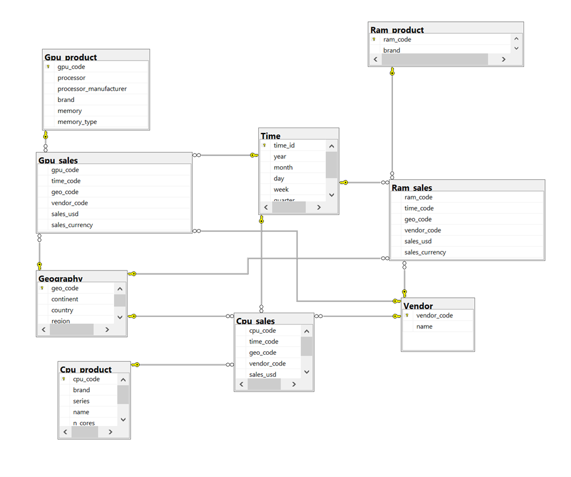
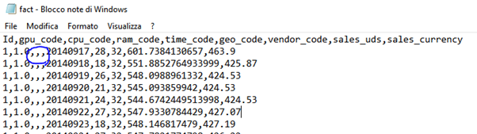

# Parte 1
 Per la parte prima del progetto, viene richiesto di creare e popolare un dataset partendo da  diversi file csv (Id, gpu_code, cpu_code, ram_code, time_code, geo_code, vendor_code , sales_uds, sales_currency).  
  
 ## Task 0
Durante la fase di creazione del database come richiesto nell’assignment 0, sono stati utilizzati esclusivamente gli strumenti forniti dal software windows sql management studio. 
Nella fase di creazione, sono state definite le tabelle con “nome tabella”, dopodichè si è proceduto alla creazione degli attributi definendo il tipo e la lunghezza in base ai dati contenuti nei vari csv, inoltre è stata attivata opzione Identity (1,1) nelle tabelle che richiedevano una chiave primaria progressiva. 
Non sono state definite le relazioni tramite chiavi perchè avrebbero potuto generare degli errori di mancata corrispondenza tra **PRIMARY KEY** e **FOREIGN KEY**. Tale problema è stato risolto durante la fase successiva, ovvero quella di caricamento (assignment 2);  popolando per prime, le tabelle che contengono le chiavi primarie.    

## Task 1:
Per completare il primo assignment, era necessario dividere il file “fact.csv” in tre differenti file, che sono poi state denominate come le seguenti  tabelle ovvero: cpu_sales, ram_sales, gpu_sales, create per il primo assignment. 
Il file fact.csv contiene una colonna per ognuno dei  tre prodotti; sottolineiamo che per ogni riga solo una delle tre colonne ha valore non nullo.
 
Riguardo le righe, originariamente sono state disposte in un ordine tale per cui all’inizio troviamo “gpu”, terminati i record con “gpu”, susseguono quelli con “cpu”, “ram” e così fino alla fine.
Questo preciso ordine è stato sfruttato per la divisione delle righe dei tre csv descritti in precedenza, con una singola iterazione su tutte le righe del file, utilizzando la libreria csv di python, la quale ci ha permesso di scrivere i tre nuovi csv derivati. 

## Task 2:
Per il caricamento dei dati sul database vi era innanzitutto una richiesta particolare per quanto riguarda la tabella sul tempo. Abbiamo pertanto designato uno script specifico per la suddetta tabella, al fine di modificare il csv e aggiungere le colonne con i valori derivati per **“quarter”** e **“weekday”** .
A questo punto ci siamo dedicati alla richiesta principale del secondo assignment: caricare i dati nelle tabelle del database definito in precedenza. Per farlo è stato creato uno script unico che interasse sui nomi delle tabelle (i file sono stati nominati allo stesso modo) e poi su tutte le righe. 
Abbiamo dovuto tener conto dei diversi tipi degli attributi e delle diverse codifiche richieste da ogni tabella al fine di generare delle query ben strutturate (con apici dove necessario, con parentesi e le virgole al posto giusto).
Per ogni riga letta dal documento è stata composta una query e lanciata. Il cursore viene anch’esso chiuso e aperto dopo ogni query lanciata. 
All'apertura di un nuovo file viene lanciata una query al solo scopo di leggere le colonne. Per far questo bisogna tenere conto che non possono essere inseriti valori per le identità, quindi abbiamo escluso dalla lettura tali colonne.

La connessione viene invece aperta e chiusa sola una volta. Tuttavia abbiamo deciso di fare un commit dopo il completamento di ogni tabella. 
A causa delle dimensione notevoli dei dati che riguardano le vendite, si è deciso  di aggiungere un contatore per effettuare un commit ogni 1500 righe, così da tenere traccia delle righe inserite fino a quel punto ed eventualmente ricominciare da dove si era interrotto. Importante è stato caricare prima le altre tabelle e poi quelle con le foreign keys. In alternativa le foreign key possono essere aggiunte successivamente al caricamento dei dati.

```python

import pyodbc 
import csv

def isfloat(value):
  try:
    float(value)
    return True
  except ValueError:
    return False

server = 'tcp:apa.di.unipi.it' 
database = 'group17HWMart' 
username = 'group17' 
password = 't9lsb' 
connectionString = 'DRIVER={ODBC Driver 17 for SQL Server};SERVER='+server+';DATABASE='+database+';UID='+username+';PWD='+ password

tables = [ 'Ram_product'] #'Time', is out cause need of tranformation 

cnxn = pyodbc.connect(connectionString)
for table in tables:
    with open('data/'+table+'.csv','r') as csv_table:
        rows = csv.DictReader(csv_table)
        
        cursor = cnxn.cursor()
        cursor.execute("SELECT * FROM "+ table )
        columns = '('
        types = []
        first = True
        if 'sales' in table or 'Time' in table : #devo leggere la prima colonna poiche nom è un 'identità'
            columns+=cursor.description[0][0]+','
        for column in cursor.description[1:]:
            columns += column[0] + ','
            types.append(column[1])
        
        print(types)
        columns = columns[:-1] + ')'
        cursor.close()
        print(columns)
        counter = 0
        for row in rows:
            
            cursor = cnxn.cursor()  #apro cursore
            values = '('
            for value in row:
                try:
                    if (row[value].isdigit() or isfloat(row[value])) and 'time' not in value:
                        if 'sales' in value: 
                            values += "'"+ str(row[value])[:str(row[value]).find('.')+3] + "', " 
                        elif 'code' in value: values += str(int(float(row[value]))) + ", "
                        else: values += str(row[value]) + ', '
                    else:
                        values += "'"+str(row[value]) + "', "
                except: print(value)
                    
            if 'sales' not in table and 'Time' not in table:
                values = '(' + values[values.find(' '):]
            values = values[:-2]+')'
            
        
       
            query = "INSERT INTO "+table+ " "+columns+" VALUES "+values
        #cursor.execute(query)
            try:
                cursor.execute(query)
                counter += 1
          
            except:
                print('ABORT',query)
                cursor.execute(query)
                cursor.close()
                cnxn.close()
            cursor.close() #chiudo cursore
            if counter == 500:
                print('COMMIT',query)
                cnxn.commit()
                counter = 0


    cnxn.commit()
        
cnxn.close()

```

